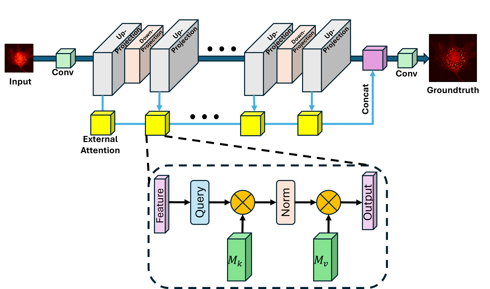
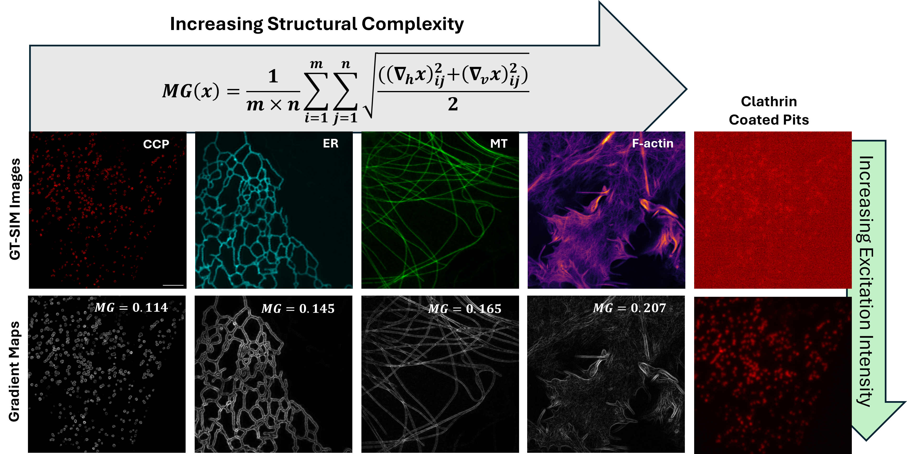
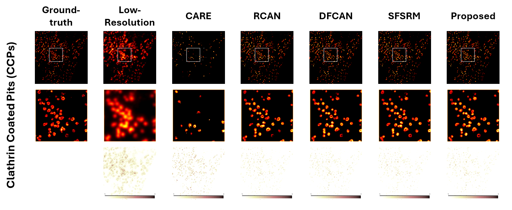

## Enhancing Fluorescence Microscopy Resolution Beyond the Diffraction Limit via Cascaded Up- and Down-Sampling Networks (CVIP2025)

<a href='https://arxiv.org/abs/2311.16518'></a> &nbsp;&nbsp;
<!--<a href='https://replicate.com/lucataco/seesr'></a> &nbsp;&nbsp; -->

[Hazique Aetesam](https://scholar.google.com/citations?user=n1fvdkwAAAAJ&hl=en)<sup>1</sup> 

<sup>1</sup>[Birla Institute of Technology Mesra](https://bitmesra.ac.in/), Patna Campus

#### 🚩Accepted by CVIP2025


### 📢 News
<!--- **2024.06** Our One-Step Real-ISR work [OSEDiff](https://github.com/cswry/OSEDiff), which achieves SeeSR-level quality but is **over 30 times faster**.
- **2024.03.10** Support [sd-turbo](https://huggingface.co/stabilityai/sd-turbo), SeeSR can get a not bad image with only **2 steps** ⚡️. Please refer to [it](#Step-sd-turbo).
- **2024.01.12** 🔥🔥🔥 Integrated to <a href='https://replicate.com/lucataco/seesr'></a> Try out <u>[Replicate](https://replicate.com/lucataco/seesr)</u> online demo ❤️ Thanks [lucataco](https://github.com/lucataco) for the implementation. 
- **2024.01.09** 🚀 Add Gradio demo, including turbo mode.-->
- **2025.10.31** Submitted camera ready version of the paper
- **2025.10.25** Received acceptance notification of the paper
- **2025.06.25** Communicated the paper to 10th International Conference on Computer Vision and Image Processing, organised by [Indian Institute of Technology, Ropar](https://iitrpr.ac.in/cvip2025).
- **2025.06.22** Created this repository

<!--
### 📌 TODO
- [ ] SeeSR-SDXL
- [ ] SeeSR-SD2-Base-face,text
- [ ] ~~SeeSR Acceleration~~ 
-->

## 🔎 Overview framework


<!--
## 📷 Real-World Results
[](https://imgsli.com/MjI5MTA2) [](https://imgsli.com/MjI5MTA3)
[](https://imgsli.com/MjI5MTA0) [](https://imgsli.com/MjI5MTA1) -->


## ⚙️ Dependencies and Installation
```
## git clone this repository
git clone https://github.com/AetesamHazique/SRFM-UpDownSamp.git
cd SRFM-UpDownSamp

# Create an environment with python <= 3.12 as many machine learning/ deep learning (ML/DL) libraries do not 
# support newer packages. Make sure to add python into the path environment during the installation process itself.

python -m venv SRFM

# Issue the following command in the command prompt to activate the environment:

SFRM\Scripts\activate.bat

# Install dependencies
pip3 install torch torchvision torchaudio --index-url https://download.pytorch.org/whl/cu118
pip3 install torchmetrics
pip3 install pillow
pip3 install opencv-python
```

## Dataset Prepearation

- Download the [BioSR](https://zenodo.org/records/7115540) dataset, extract the `.zip` files and arrange them in a folder. BioSR is a biological image dataset for super-resolution microscopy, currently including more than 2200 pairs of low-and-high resolution images covering four biology structures (CCPs, ER, MTs, F-actin), nine signal levels (15-600 average photon count), and two upscaling-factors (linear SIM and non-linear SIM). BioSR is now freely available, aiming to provide a high-quality dataset for the community of single bio-image super-resolution algorithm and advanced SIM reconstruction algorithm developers.
- Use the MATLAB files [`DataAugumentation_ForTrain.m`](BioSR/DataAugumentation_ForTrain.m) and [`DataAugumentation_ForTest.m`](BioSR/DataAugumentation_ForTest.m) given in the repository to generate training and testing datasets respectively. The same code is also present in the original github repo [DL-SR](https://github.com/qc17-THU/DL-SR/tree/7f9c8865aea1e6a067d055d419b19a459e7102c1/data_agmt_matlab).
- After executing the above MATLAB files, the training and test images get stored in the [`Training`](BioSR/Training) and [`Testing`](BioSR/Testing) sub-folders of the [BioSR](BioSR) directory in the repository.

<div align=center class="logo">
      
   </a>
</div>


## 🚀 Quick Inference
#### Step 1: Download the pretrained models
- Download the pretrained models from [Google Drive](https://drive.google.com/drive/folders/1XBvIzog1eNCtRPRFD4xJSA6B5_MNPNkm?usp=sharing). You can put the models into [`model/Pretrained`](model/Pretrained) folder.


#### Step 2: Prepare testing data
You can put the test images in the [`BioSR/Testing/`](BioSR/Testing).

#### Step 3: Running `eval1.ipynb` file

- Run the file [`eval1.ipynb`](eval1.ipynb)
- The results get stored in [`Results`](Results) directory.

<div align=center class="logo">
      
   </a>
</div>

## 🌈 Train 

#### Step1: Prepare training data

Generate the dataset as shown in the previous step

##### Step2: Model Configuration Settings

```
# Number of GPUs
gpus=1
# Whether to use GPU or not
gpu_mode=True
# Random seed to use.
seed=123
# Super resolution upscale factor
upscale_factor=2
# Whether to use pretrained model state
pretrained=False
# Location to the pretrained models checkpoints
save_folder='models/Pretrained/'
#Meta data folder
meta_folder='Meta-folder/'
# Name of the pretrained SR model to load')
pretrained_sr='DBPNccp2x-check_epoch_3.pth'
# Type of the model to use ', type=str, default='DBPNLL')
model_type="DBPN"
# Use the below option only if residual learning is desired
residual=False
# parser.add_argument('--start_iter', type=int, default=1, help='Starting Epoch')
start_iter=1
# parser.add_argument('--nEpochs', type=int, default=2000, help='number of epochs to train for')
nEpochs=100
# 'Frequency of storing model checkpoints (after how many epoch hops)
snapshots=5
# parser.add_argument('--lr', type=float, default=1e-4, help='Learning Rate. Default=0.01')
lrate=1e-4
# Descriptive Name of model checkpoint
prefix='CCPs2x'
```
#### Step3: Start the training process

Execute the file `Training.ipynb`


## ❤️ Acknowledgments
This project is based on 
- [DBPN](https://github.com/alterzero/DBPN-Pytorch) 
and 
- [External Attention](https://github.com/xmu-xiaoma666/External-Attention-pytorch)
- This work is supported by Seed Grant from [Birla Institute of Technology Mesra](https://bitmesra.ac.in/). Grant number:  DRIE/SMS/DRIE-10886/2024-25

## 📧 Contact
If you have any questions, please feel free to contact: `hazique@bitmesra.ac.in`

## 🎓Citations
If our code helps your research or work, please consider citing our paper.
The following are BibTeX references:

```
@inproceedings{aetesam2025two,
  title={Enhancing Fluorescence Microscopy Resolution Beyond the Diffraction Limit via Cascaded Up-and Down-Sampling Networks},
  author={Aetesam, Hazique},
  booktitle={International Conference on Computer Vision and Image Processing},
  pages={179--190},
  year={2025},
  organization={Springer}
}

```

## 🎫 License
This project and related weights are released under the [Apache 2.0 license](LICENSE).


<details>
<summary>statistics</summary>


</details>
